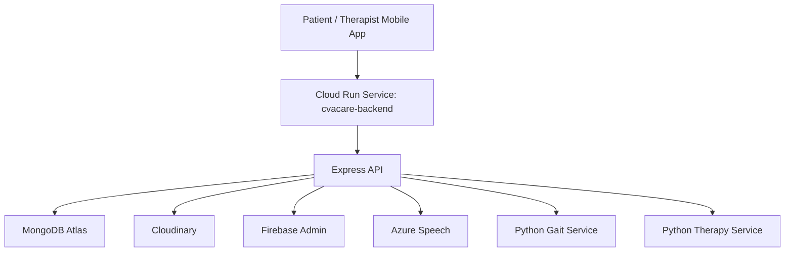
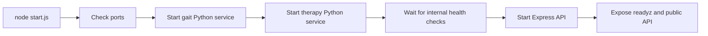

# CVAPed / CVAPed Mobile Platform


CVAPed is a mobile rehabilitation platform for stroke care that combines a React Native patient app with a Node.js backend and two Python ML services. The system supports authentication, therapist and admin workflows, gait analysis, speech therapy assessments, prescriptive exercise planning, progress tracking, appointments, and success story management.

This repository is structured as a production-ready monorepo:

- `frontend/` contains the Expo / React Native mobile app.
- `backend/` contains the Express API, MongoDB models, and the Python gait and therapy services.
- `.github/workflows/deploy-cloud-run.yml` defines automated backend deployment to Google Cloud Run.
- `render.yaml` provides an alternative Render blueprint for Docker-based deployment.

## Table of Contents

- [Production Snapshot](#production-snapshot)
- [Why This Project Exists](#why-this-project-exists)
- [Core Capabilities](#core-capabilities)
- [Architecture](#architecture)
- [Technology Stack](#technology-stack)
- [Repository Structure](#repository-structure)
- [Main API Areas](#main-api-areas)
- [Local Development Setup](#local-development-setup)
- [Environment Variables](#environment-variables)
- [Production Deployment](#production-deployment)
- [Screens And Roles](#screens-and-roles)
- [Docker](#docker)
- [Operational Checks](#operational-checks)
- [Security Notes](#security-notes)
- [Troubleshooting](#troubleshooting)
- [Useful Files](#useful-files)
- [License](#license)

## Production Snapshot

- Mobile app: Expo / EAS managed React Native application
- Primary backend deployment target: Google Cloud Run
- Production backend base URL: `https://cvacare-backend-526387613359.us-central1.run.app`
- API base URL used by the mobile app: `https://cvacare-backend-526387613359.us-central1.run.app/api`
- Database: MongoDB Atlas
- Media storage: Cloudinary
- Authentication: JWT + Google Sign-In + Firebase Admin verification
- Speech processing: Azure Speech

## Why This Project Exists

Stroke rehabilitation often spans multiple therapy areas, repeated home exercises, clinician oversight, and ongoing progress measurement. CVAPed brings those workflows into one platform by pairing a mobile experience for patients with a backend that can coordinate analytics, assessments, therapy guidance, and therapist/admin oversight in production.

The repository is already aligned with a deployed backend model rather than a demo-only setup:

- the frontend defaults to a live Cloud Run backend
- the backend container is designed to run multiple internal services together
- deployment and smoke test workflows are already codified in repository config
- environment templates are structured around production infrastructure and managed secrets

## Core Capabilities

- Patient onboarding with email/password login and Google Sign-In
- Role-aware experiences for patients, therapists, and admins
- Initial diagnostic intake and therapy targeting
- Gait capture from mobile sensors with backend validation and ML-powered analysis
- Speech therapy flows for articulation, fluency, receptive language, expressive language, and overall prediction
- Exercise recommendation and prescriptive planning backed by Python services
- Progress persistence for gait, language, articulation, and fluency sessions
- Appointment scheduling for patients and therapists
- Therapist-managed success stories with Cloudinary image uploads
- Admin reporting and user management endpoints

## Architecture

The backend runs as a multi-process container. One Node.js service orchestrates API traffic and database access, while two internal Python services handle ML-heavy processing.

### High-Level Runtime

```text
React Native App (Expo/EAS)
        |
        v
Express API (`backend/server.js`)
        |
        +--> MongoDB Atlas
        +--> Cloudinary
        +--> Firebase Admin
        +--> Azure Speech
        +--> Python Gait Service (`backend/gait-analysis/app.py`)
        \--> Python Therapy Service (`backend/therapy-exercises/app.py`)
```

Runtime orchestration happens in `backend/start.js`, which:

- checks required ports
- starts the Python gait service
- starts the Python therapy service
- waits for both internal services to become healthy
- starts the Node.js API only after dependencies are ready

This design is what enables the Docker image to run cleanly on Cloud Run and Render as a single backend service.

### Production Deployment View



### Service Startup Flow



## Technology Stack

### Frontend

- React `19.1.0`
- React Native `0.81.4`
- Expo `~54.0.13`
- Firebase Auth / Google Sign-In
- Expo AV, Sensors, Image Picker, Splash Screen, Linear Gradient

### Backend

- Node.js `>=20`
- Express `4.18`
- MongoDB + Mongoose `7.5`
- JWT authentication
- Multer for file uploads
- Cloudinary SDK for image hosting
- Azure Speech SDK for speech assessment flows

### Python Services

- Flask-based gait analysis service
- Flask-based therapy / recommendation service
- ML model artifacts stored in `backend/therapy-exercises/models/`

### DevOps / Deployment

- Docker
- Google Cloud Run
- GitHub Actions
- Render blueprint support
- Expo Application Services (EAS)

## Repository Structure

```text
.
|- frontend/                    Expo React Native mobile app
|  |- components/              UI screens and flows
|  |- services/                API clients
|  |- config/                  Firebase and API runtime config
|  |- scripts/                 Build and backend verification helpers
|  |- app.json                 Expo app metadata
|  \- eas.json                 EAS build profiles
|
|- backend/                     API and ML services
|  |- config/                   Database, runtime, Cloudinary, Firebase config
|  |- controllers/             Express controllers
|  |- middleware/              Auth and request middleware
|  |- models/                  Mongoose schemas
|  |- routes/                  REST API routes
|  |- gait-analysis/           Python gait analysis service
|  |- therapy-exercises/       Python therapy / recommendation service
|  |- docs/                    Deployment notes
|  |- Dockerfile               Production container image
|  |- start.js                 Multi-service process entrypoint
|  \- server.js                Express app bootstrap
|
|- .github/workflows/          CI/CD workflow for Cloud Run
|- render.yaml                 Render deployment blueprint
\- README.md
```

## Main API Areas

The Express app in `backend/server.js` exposes these major route groups:

- `api/auth` - registration, login, Google auth, profile completion, self profile updates
- `api/gait` - gait analysis, real-time analysis, gait history, service health
- `api/exercises` - exercise retrieval and planning flows
- `api/articulation` - articulation progress, exercises, and recording assessment
- `api/fluency` - fluency progress, exercises, and assessment
- `api/receptive` - receptive language therapy flows
- `api/expressive` - expressive language therapy flows
- `api/speech` - overall speech improvement prediction
- `api/therapist` - therapist dashboards and reports
- `api/admin` - admin stats and user management
- `api/success-stories` - public reads plus therapist CRUD for stories and images
- `api/health` - health logging and health summaries
- shared `api` routes - appointment scheduling and diagnostic comparison

Useful production health endpoints:

- `GET /` - API liveness and metadata
- `GET /healthz` - lightweight container health
- `GET /readyz` - readiness check for database + internal Python services
- `GET /api/gait/health` - gait service health
- `GET /api/therapy/health` - therapy service health

## Local Development Setup

### Prerequisites

- Node.js 20+
- npm
- Python 3.10+ with `pip`
- MongoDB Atlas connection string or local MongoDB instance
- Expo CLI tooling through `npx expo`
- Android Studio / emulator or a physical device with Expo Go / development build

### 1. Clone and install dependencies

```bash
git clone <your-repo-url>
cd "CVAPed Mobile - Backend"

cd backend
npm install

cd ../frontend
npm install
```

### 2. Configure environment files

Use these templates:

- `backend/.env.example`
- `frontend/.env.example`

Create:

- `backend/.env`
- `frontend/.env`

### 3. Start the backend

From `backend/`:

```bash
npm start
```

This launches:

- Express API on `PORT` (default local fallback `5000`, production `8080`)
- gait service on `GAIT_ANALYSIS_PORT` (default `5001`)
- therapy service on `THERAPY_PORT` (default `5002`)

If `USE_GLOBAL_PYTHON=true`, the backend uses your system Python. Otherwise `backend/start.js` creates virtual environments inside each Python service and installs requirements automatically.

### 4. Start the mobile app

From `frontend/`:

```bash
npm start
```

Common targets:

```bash
npm run android
npm run ios
npm run web
```

### 5. Verify backend connectivity from the frontend workspace

From `frontend/`:

```bash
npm run verify:backend
```

That script checks:

- root API reachability
- `/readyz`
- gait service health
- therapy service health

## Environment Variables

### Backend

Required production variables are documented in `backend/docs/DEPLOYMENT.md` and encoded in `render.yaml` / `.github/workflows/deploy-cloud-run.yml`.

Important keys:

```env
NODE_ENV=production
FLASK_ENV=production
USE_GLOBAL_PYTHON=true
PORT=8080
GAIT_ANALYSIS_PORT=5001
THERAPY_PORT=5002
MONGODB_URI=...
DB_NAME=CVACare
JWT_SECRET=...
SECRET_KEY=...
CORS_ORIGINS=https://your-frontend-domain.com
GOOGLE_CLIENT_ID=...
CLOUDINARY_CLOUD_NAME=...
CLOUDINARY_API_KEY=...
CLOUDINARY_API_SECRET=...
AZURE_SPEECH_KEY=...
AZURE_SPEECH_REGION=...
FIREBASE_SERVICE_ACCOUNT_JSON_BASE64=...
```

### Frontend

```env
EXPO_PUBLIC_API_URL=https://cvacare-backend-526387613359.us-central1.run.app/api
EXPO_PUBLIC_GAIT_API_URL=https://cvacare-backend-526387613359.us-central1.run.app
EXPO_PUBLIC_THERAPY_API_URL=https://cvacare-backend-526387613359.us-central1.run.app
EXPO_PUBLIC_GOOGLE_WEB_CLIENT_ID=your-google-web-client-id.apps.googleusercontent.com
```

## Production Deployment

### Primary: Google Cloud Run

The backend is set up for Cloud Run deployment through `.github/workflows/deploy-cloud-run.yml`.

Deployment flow:

1. Push to `main`
2. GitHub Actions authenticates to Google Cloud using `GCP_SA_KEY`
3. The workflow builds the Docker image from `backend/`
4. The image is pushed to Artifact Registry
5. Cloud Run deploys the new revision
6. Smoke tests call `/readyz` and `/`

Cloud Run configuration currently encoded in the workflow:

- region: `us-central1`
- service: `cvacare-backend`
- memory: `2Gi`
- cpu: `1`
- timeout: `300s`
- max instances: `3`
- unauthenticated ingress enabled for the public API

Required GitHub repository secrets:

- `GCP_SA_KEY`
- `CORS_ORIGINS`
- `MONGODB_URI`
- `DB_NAME`
- `JWT_SECRET`
- `GOOGLE_CLIENT_ID`
- `CLOUDINARY_CLOUD_NAME`
- `CLOUDINARY_API_KEY`
- `CLOUDINARY_API_SECRET`
- `AZURE_SPEECH_KEY`
- `AZURE_SPEECH_REGION`
- `FIREBASE_SERVICE_ACCOUNT_JSON_BASE64`

### Production Rollout Checklist

- rotate any previously exposed secrets before public deployment
- configure repository secrets for GitHub Actions
- confirm `CORS_ORIGINS` only includes approved frontend origins
- deploy backend from `main`
- verify `GET /readyz` and `GET /`
- point `frontend/.env` or EAS env vars to the live backend URL
- run the mobile app against production and validate auth, gait, speech, uploads, and appointments

### Alternative: Render

If you prefer Render, use `render.yaml` or follow `backend/docs/RENDER_DEPLOYMENT.md`.

Important notes:

- deploy as a single Docker web service
- expose port `8080`
- use `/readyz` as the health check
- starter-sized instances are recommended because the Python ML services need more memory than very small plans usually provide

### Mobile Production Builds

The app is configured for EAS in `frontend/eas.json` with `development`, `preview`, `production`, and `production-apk` profiles.

Typical production flow:

```bash
cd frontend
eas build --platform android --profile production
eas build --platform ios --profile production
```

Google services integration is prepared via `frontend/scripts/prepare-google-services.js` and `frontend/app.config.js`.

## Screens And Roles

The mobile app is structured around role-aware flows visible in `frontend/App.js` and the `frontend/components/` directory.

- patients land in the primary home, therapy, health, prediction, prescriptive, and appointment flows
- therapists get therapist dashboards plus therapist-only success story management capabilities
- admins get a dedicated admin dashboard with user and high-level platform stats
- first-time or partially configured users are guided through landing, login, registration, and profile completion flows

## Docker

Build and run the backend locally with Docker:

```bash
docker build -t cvacare-backend ./backend
docker run --env-file ./backend/.env -p 8080:8080 cvacare-backend
```

There is also a local compose file in `backend/docker-compose.yml`.

```bash
cd backend
docker compose up --build
```

## Operational Checks

Before calling the system production-ready, verify:

- `GET /readyz` returns `ready: true`
- `GET /` returns API metadata
- email/password login works
- Google Sign-In works
- success story image upload works
- articulation and fluency audio assessments work
- gait analysis can be submitted successfully
- therapy recommendation endpoints return results

## Security Notes

- Rotate any secrets that were ever stored in tracked local files before a public production rollout.
- Prefer `FIREBASE_SERVICE_ACCOUNT_JSON_BASE64` or another secret manager backed approach instead of committing service account files.
- Keep `JWT_SECRET` and `SECRET_KEY` aligned in production.
- Restrict `CORS_ORIGINS` to approved frontend origins only.
- Do not expose database credentials in client builds.

## Troubleshooting

- If `/readyz` fails, check MongoDB connectivity first, then the Python service logs.
- If Google Sign-In fails in production, verify both `GOOGLE_CLIENT_ID` on the backend and `EXPO_PUBLIC_GOOGLE_WEB_CLIENT_ID` on the frontend.
- If image uploads fail, verify the Cloudinary credentials and therapist authorization.
- If speech features fail, verify Azure Speech key and region values.
- If gait or therapy routes fail, verify the internal services started on ports `5001` and `5002` or that `GAIT_ANALYSIS_URL` / `THERAPY_URL` are set correctly.

## Useful Files

- `backend/start.js` - multi-service production entrypoint
- `backend/server.js` - Express bootstrap and route registration
- `backend/docs/DEPLOYMENT.md` - backend deployment notes
- `backend/docs/RENDER_DEPLOYMENT.md` - Render-specific guide
- `.github/workflows/deploy-cloud-run.yml` - CI/CD pipeline for Cloud Run
- `frontend/config/apiConfig.js` - frontend API base URL resolution
- `frontend/scripts/verify-backend.js` - backend readiness verifier

## License

No root license file is present in this repository. The backend package metadata declares `ISC`, so confirm your intended repository-wide license before publishing externally.
